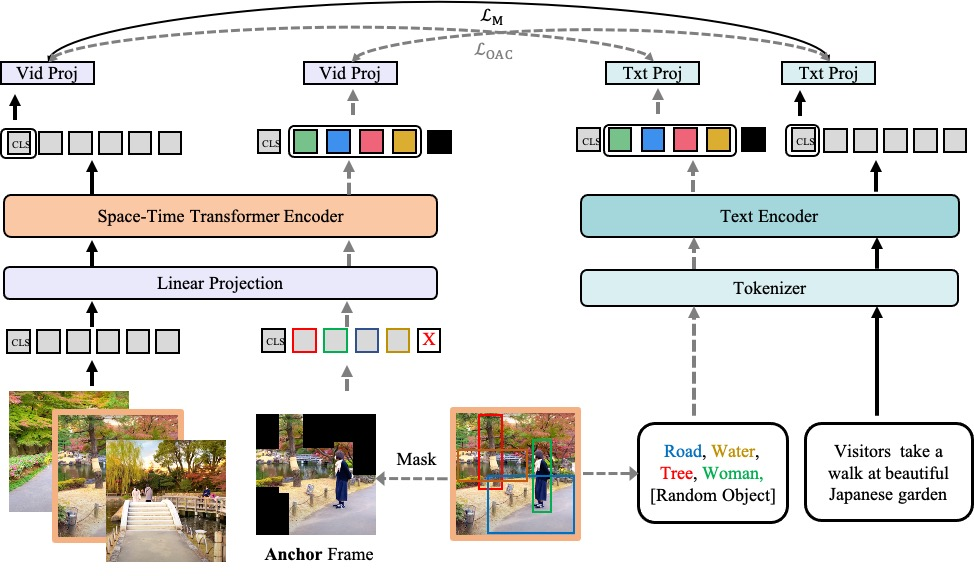
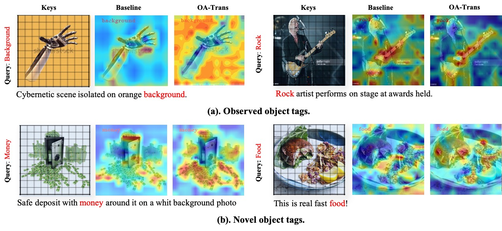
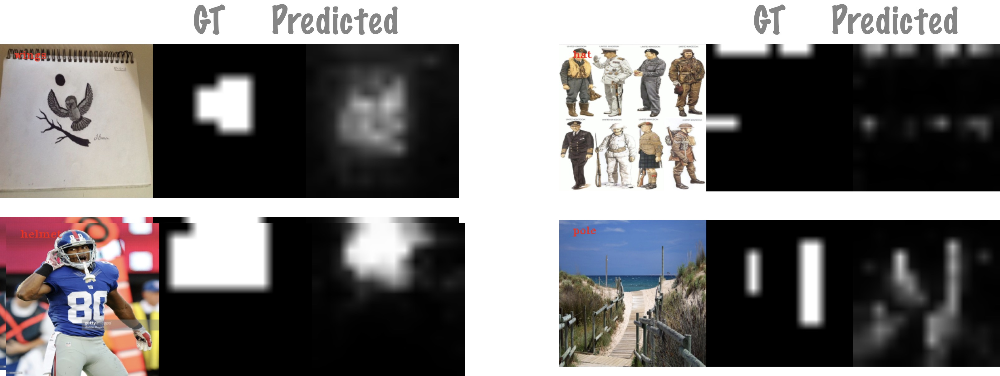

# [CVPR 22] "Object-aware Video-language Pre-training for Retrieval" [arxiv](https://arxiv.org/abs/2112.00656)





## 1. Object Feature Extractor

We provide a faster version to extract object from WebVid 2.5M and CC 3M.
We extract objects of 5.5M * 8 = 44M frames in total and it takes 28 days on 16 V100 GPUs.

Refer to [Object Extractor.md](object_extraction.md) for more details.


## 2. OA Trans

Refer to [train.md](train.md) for more details.

## 3. Visualizations

In this code, we provide two ways to visualize cross-modality attention.

### Heatmap Visualization



### Binary Map Visualization


Please refer to [visualization.md](visualization.md) for details.


## News:
- 2021.12.5 Arxiv Version Published.
- 2022.3.15 First version Code Released.

## 5. Citation

If you find our work helpful, please cite our paper
```bash
@article{wang2022oatrans,
  title={Object-aware Video-language Pre-training for Retrieval},
  author={Wang, Alex Jinpeng and Ge, Yixiao and Cai, Guanyu and Yan, Rui and Lin, Xudong and Shan, Ying and Qie, Xiaohu and Shou, Mike Zheng},
  journal={Proceedings of the IEEE/CVF International Conference on Computer Vision},
  year={2022}
}
```

## Acknowledgement

This work is mainly based on [Frozen](https://github.com/m-bain/frozen-in-time).