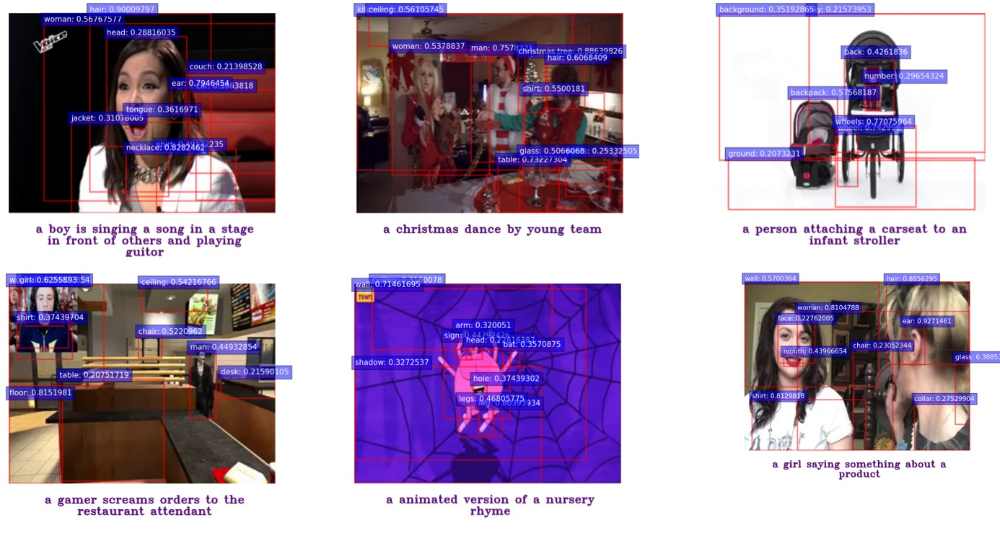

## Install


Please follow [BUTD](https://github.com/MILVLG/bottom-up-attention.pytorch) to install detectron2.

Then download pretrained model from [Google Driver](https://drive.google.com/file/d/1zFqaeNMDa6HL4tBWJd5BKu_AhCkqtacs/view?usp=sharing) and place it into pretrained.

```bash
cd bottom-up-attention.pytorch
mkdir pretrained
mv [path_to_downloaded_pth] pretrained/
```

### Replace feature_extract
Original BUTD provide script [feature_extract.py](https://github.com/MILVLG/bottom-up-attention.pytorch/blob/master/extract_features.py) to extract object with distributed framework ray.
However, we find this tool is not stable and slowly.
So we implement a 3times faster multiprocess version.

Simple replace feature_extract.py with [extract_cc3m](ObjectExtractor/multiprocess_full_cc3m_complementary_modify_tsv_gen_from_video.py) and [extract_wevic](ObjectExtractor/multiprocess_full_webvid_multiframe_complementary_modify_tsv_gen_from_video.py).

### Webvid 2.5M
```bash
python3 multiprocess_full_webvid_multiframe_complementary_modify_tsv_gen_from_video.py --mode caffe \
       --num-cpus 32 --gpus '0,1,2,3,4,5,6,7' \
       --workers_per_gpu 2 \
       --sampling_frames 8 \
       --split "train" \
       --dataset_dir "WebVid" \
       --extract-mode roi_feats \
       --min-max-boxes '10,100' \
       --config-file configs/bua-caffe/extract-bua-caffe-r101.yaml
```


### CC3M
```bash
python3 multiprocess_full_cc3m_complementary_modify_tsv_gen_from_video.py \
--mode caffe --num-cpus 0 --gpus '0,1,2,3,4,5,6,7' \
--extract-mode roi_feats --min-max-boxes '10,100' \
--config-file configs/bua-caffe/extract-bua-caffe-r101.yaml
```

### Visualization
We visualize some extracted bounding boxes as below:
