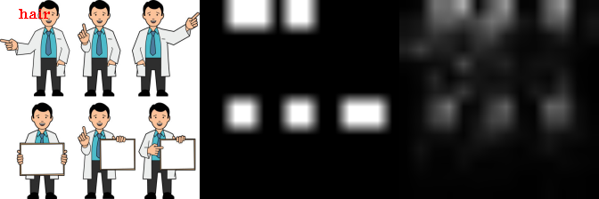

# Cross-modality Visualization Tools

## Heatmap Visualization

```bash
cd Visualizaztion/Cross_Modality_Transformer_Visualization
mkdir pretrained
cd pretrained && mkdir distillbert-base-uncased
```

Then download all files in [/distilbert-base-uncased](https://huggingface.co/distilbert-base-uncased/tree/main) and place these file in the directory distillbert-base-uncased.


### Image

```bash
python main_img.py
```
We provide both _feature map visualization_ and _cross-modality attention visualize._


### Video

```bash
python main_video.py
```

## Binary Map Visualization

If we ask the model to learn fine-grained align we can generate binary map as below:

Refer to file [test_region_mem.py](OATrans/test_region_mem.py) for details.

